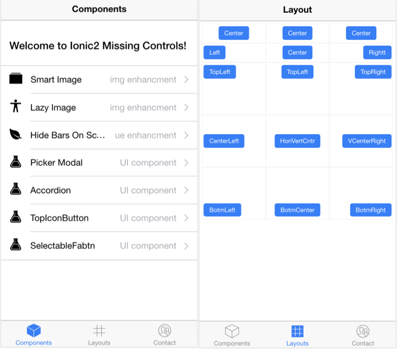

Ionic2 missing controls
----------------------------

This project collect and migrate controls in other mobile UI framework or open-source components that not included in Ionic2 framework.

And integrate fontawesome library in this ionic project.

## screen shots




## usage

clone this repository and cd directory then run:
```
$ npm install
$ ionic serve
```

## functionality components

* Smart Image (inspired by img-fallback)
* Hide Bars On Scroll (from Framework7)
* Picker Modal (from Framework7)
* Accordion/Collapsible (from Framework7)
* Top icon button
* selectable Fab Button group
* ...

## UI enforcements

* Central Box
* left/center/right Box
* 9 scale grid layout
* ...


## update records

* first create at 2016/09/17
* then migrated to ionic2 rc.1 at 2016/10/18
* ionic2 upgrade to rc.3 at 2016/12/02
* first complete version released at 2016/12/06
* v1.0 released based on ionic2 final at 2017/02/05
* ...
